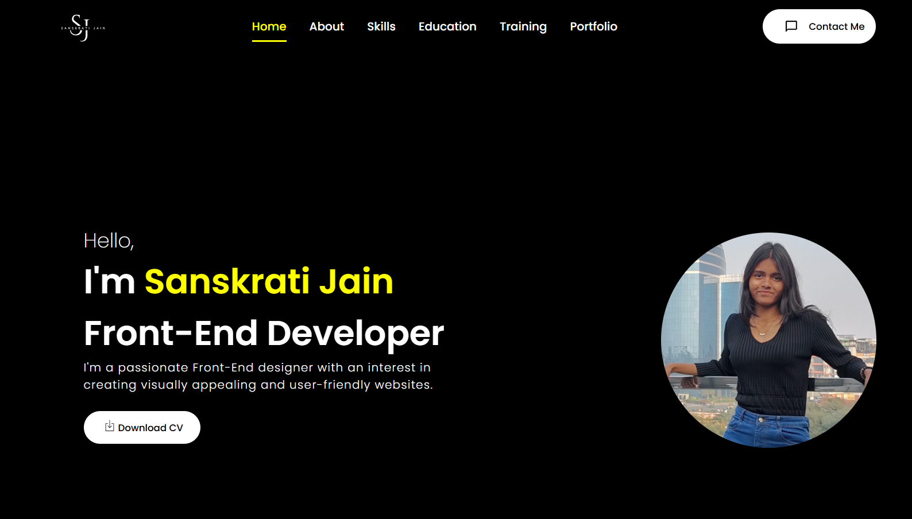

# 🌐 Personal Portfolio Website

This is my **personal portfolio website** built using **React.js**. It showcases my projects, skills, certifications, contact form, and professional experience in a clean and responsive design.



## 🚀 Live Website

🔗 [Click to Visit My Portfolio](https://sanskrati-jain-portfolio-website-six-pi-41.vercel.app/)

---

## 📌 Features

- ✅ Fully responsive and mobile-friendly UI
- 🎨 Modern design built with HTML, CSS, JavaScript, and React
- 💼 Project showcase with image previews and modal popups
- 📫 Contact form that sends messages directly to email using **EmailJS**
- 🌐 Linked to GitHub, LinkedIn, and Instagram profiles
- 📝 Dynamic components and clean code architecture

---

## 🛠️ Tech Stack

| Category       | Technology              |
|----------------|--------------------------|
| Frontend       | React.js, HTML5, CSS3    |
| Styling        | Custom CSS (responsive)  |
| Icons          | `react-icons`            |
| Email Handling | [EmailJS](https://www.emailjs.com/) |
| Hosting        | Vercel / Netlify         |
| Version Control| Git & GitHub             |

---

## 📂 Folder Structure

```
portfolio/
├── public/
├── src/
│ ├── assets/
│ ├── components/
│ │ ├── About
│ │ ├── Certifications
│ │ ├── Contact
│ │ ├── Education
│ │ ├── Footer
│ │ ├── Intro
│ │ ├── NavBar
│ │ ├── Projects
│ │ ├── Skills
│ │ ├── Training
│ ├── App.js
│ ├── index.js
├── .gitignore
├── package.json
└── README.md
```

---

## 📬 Contact Form Setup

This portfolio uses **EmailJS** to send form submissions to your inbox.

> Steps to make it work:
1. Create an account at [emailjs.com](https://www.emailjs.com)
2. Create a new service and email template
3. Replace the `service_id`, `template_id`, and `user_id` in `Contact.js`

---

## 💡 How to Use

1. **Clone the Repository**

```bash
git clone https://github.com/sanskrati0613/portfolioWebsite.git
cd portfolioWebsite
```

2. **Install Dependencies**

```bash
npm install
```

3. **Run Locally**

```bash
npm start
```

4. **Build for Production**

```bash
npm run build
```

---

## 📦 Deployment

- The site is deployed via **Vercel** (or Netlify)
- Auto deployment is triggered when changes are pushed to GitHub

---

## 🙋‍♀️ Author

**Sanskrati Jain**

- GitHub: [@sanskrati0613](https://github.com/sanskrati0613)
- LinkedIn: [Sanskrati Jain](https://www.linkedin.com/in/sanskrati-jain-295b65271)
- Instagram: [@trivia_noon](https://www.instagram.com/trivia_noon/)

---

## ⭐ Acknowledgements

- [Create React App](https://create-react-app.dev/)
- [EmailJS Docs](https://www.emailjs.com/docs/)
- [React Icons](https://react-icons.github.io/react-icons/)

---

## 📜 License

This project is licensed under the [MIT License](LICENSE).