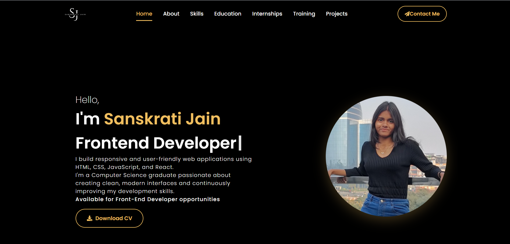

# 🌐 Personal Portfolio Website

A modern, responsive portfolio website built with **React.js** and powered by **Sanity CMS**. The portfolio showcases my projects, technical skills, education, internships, and resume while allowing content to be updated dynamically without modifying the source code.



## 🚀 Live Website

🔗 [Click to Visit My Portfolio](https://sanskrati-jain-portfolio-website-six-pi-41.vercel.app/)

---

## 📌 Features

- 🎨 Modern, responsive UI
- 📂 Dynamic Projects section powered by **Sanity CMS**
- 🛠 Dynamic Skills section with categorized technologies
- 📄 Resume managed through Sanity CMS
- 📅 Automatically displays the latest resume update date
- 🔍 Project filtering by category
- 🖼 Project modal with technologies and external links
- 📫 Contact form powered by EmailJS
- 🌐 Social media integration (GitHub, LinkedIn, Gmail & Instagram)
- ⚡ Fast deployment using Vercel

---

## 🛠️ Tech Stack

| Category | Technologies |
|----------|--------------|
| Frontend | React.js, HTML5, CSS3, JavaScript |
| CMS | Sanity CMS |
| Styling | Custom CSS |
| Icons | React Icons |
| Email Service | EmailJS |
| Hosting | Vercel |
| Version Control | Git & GitHub |

---


## 📂 Current Sections

- Home
- About
- Skills (CMS Powered)
- Education
- Internships
- Projects (CMS Powered)
- Resume (CMS Powered)
- Contact

---

## 🚀 CMS Features

This portfolio uses **Sanity CMS** to manage content dynamically.

Currently managed through Sanity:

- ✅ Projects
- ✅ Skills
- ✅ Resume

Upcoming CMS sections:

- 📜 Certificates
- 💼 Experience
- 🏆 Achievements

This allows me to update my portfolio without modifying the React code or redeploying for every content change.

---

## 📂 Folder Structure

```
portfolio/
├── public/
├── sanity/
├── src/
│ ├── assets/
│ ├── components/
│ │ ├── About
│ │ ├── Certifications
│ │ ├── Contact
│ │ ├── Education
│ │ ├── Footer
│ │ ├── Internships
│ │ ├── Intro
│ │ ├── NavBar
│ │ ├── Projects
│ │ ├── Skills
│ │ ├── Training
│ ├── App.js
│ ├── index.js
├── .gitignore
├── package.json
└── README.md
```

---

## 📬 Contact Form Setup

This portfolio uses **EmailJS** to send form submissions to your inbox.

> Steps to make it work:
1. Create an account at [emailjs.com](https://www.emailjs.com)
2. Create a new service and email template
3. Replace the `service_id`, `template_id`, and `user_id` in `Contact.js`

---

## 💡 How to Use

1. **Clone the Repository**

```bash
git clone https://github.com/sanskrati0613/portfolioWebsite.git
cd portfolioWebsite
```

2. **Install Dependencies**

```bash
npm install
```

3. **Run Locally**

```bash
npm start
```

4. **Build for Production**

```bash
npm run build
```

---

## 📦 Deployment

- The site is deployed via **Vercel**
- Auto deployment is triggered when changes are pushed to GitHub

---

## 🙋‍♀️ Author

**Sanskrati Jain**

- GitHub: [@sanskrati0613](https://github.com/sanskrati0613)
- LinkedIn: [Sanskrati Jain](https://www.linkedin.com/in/sanskrati-jain-295b65271)
- Instagram: [@trivia_noon](https://www.instagram.com/trivia_noon/)

---

## ⭐ Acknowledgements

- [Create React App](https://create-react-app.dev/)
- [EmailJS Docs](https://www.emailjs.com/docs/)
- [React Icons](https://react-icons.github.io/react-icons/)

---

## 📜 License

This project is licensed under the [MIT License](LICENSE).